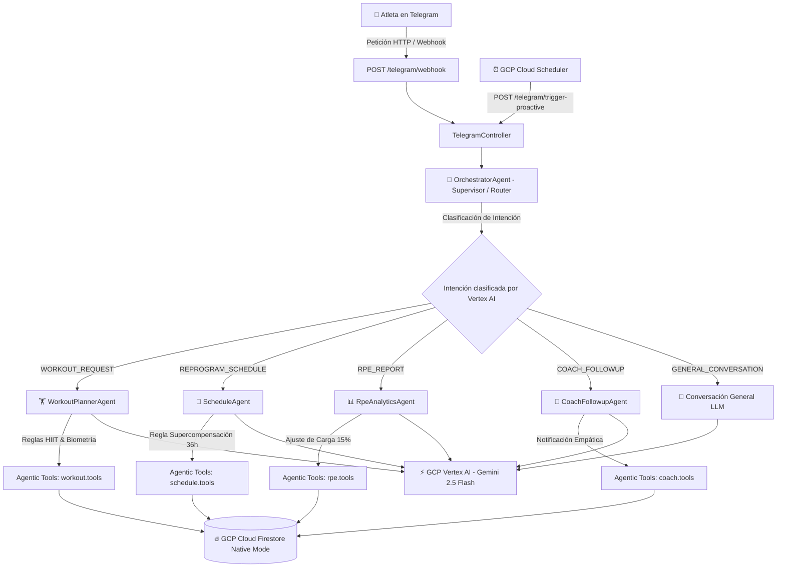

# 🔥 QuickBurn AI - Coach Deportivo Inteligente de HIIT

[](https://nestjs.com/)
[](https://cloud.google.com/)
[](https://deepmind.google/technologies/gemini/)
[](https://telegram.org/)
[](LICENSE)

**QuickBurn AI** es una plataforma agéntica conversacional y proactiva de entrenamiento deportivo especializado en **HIIT (High-Intensity Interval Training)**. Desarrollada con arquitectura **Multiagente (Supervisor Pattern)** en **NestJS**, impulsada por **Google Cloud Vertex AI (Gemini 2.5 Flash)** y desplegada en infraestructura **Serverless en GCP (Cloud Run, Cloud Firestore, Cloud Build & Cloud Scheduler)**.

---

## 🏗️ Arquitectura del Sistema (Supervisor Pattern)

El ecosistema está diseñado bajo el paradigma de **Sistemas Inteligentes Multiagente**, donde un **Agente Supervisor (OrchestratorAgent)** clasifica la intención conversacional del atleta y delega la ejecución a subagentes expertos:



---

## 🌟 Los 5 Pilares de Demostración de Sistemas Inteligentes

1. **Memoria Híbrida Conversacional (Google ADK Standard):**  
   Implementa una **Ventana Deslizante de 10 Mensajes (Sliding Window)** acotada en Firestore (`/users/{userId}/sessions/active`) garantizando token-efficiency y cero latencia, combinada con la **Ficha Técnica Biológica Permanente** del perfil del atleta.

2. **Guardrails de Seguridad:**  
   Filtro de entrada ([prompt-safety.guardrails.ts](file:///c:/Users/ljmm9/dev/ingenieria%20del%20software/quickburn-ai/src/guardrails/prompt-safety.guardrails.ts)) que previene ataques de *Prompt Injection* y rechaza consultas fuera de contexto deportivo.

3. **Observabilidad (Chain of Thought):**  
   Logger agéntico especializado ([agent-logger.service.ts](file:///c:/Users/ljmm9/dev/ingenieria%20del%20software/quickburn-ai/src/telemetry/agent-logger.service.ts)) que traza en consola la razonamiento agéntico y la ejecución de *Agentic Tools / Function Calling*.

4. **Reglas Fisiológicas & Deportivas:**  
   - **Regla RN-01:** Validación estricta de ventana de descanso obligatorio (36-48h) basada en principios de supercompensación.
   - **Fórmula de FCM & METs:** Cálculo automático de Frecuencia Cardíaca Máxima ($\text{FCM} = 220 - \text{edad}$) e Índice de Masa Corporal ($\text{IMC}$).

5. **Human-in-the-Loop (HITL) e Interfaz Empática:**  
   Flujo de Onboarding biológico incremental de 4 pasos con extracción NLP/LLM de biometría y ocupación, y botones interactivos en Telegram.

---

## 🚀 Despliegue Serverless en Google Cloud Platform (GCP)

El proyecto está containerizado y preparado para producción con arquitectura **100% Serverless (Escala a $0.00 inactivo)**:

- **GCP Cloud Run:** Servidor containerizado de NestJS desplegado en `us-central1`.
- **GCP Cloud Build:** Pipeline CI/CD automático ([cloudbuild.yaml](file:///c:/Users/ljmm9/dev/ingenieria%20del%20software/quickburn-ai/cloudbuild.yaml)) que compila y actualiza Cloud Run en cada `git push`.
- **GCP Artifact Registry:** Registro de contenedores en `us-central1-docker.pkg.dev`.
- **GCP Cloud Scheduler:** Cron Jobs programados para notificaciones proactivas de adherencia.
- **GCP Firestore Native Mode:** Base de datos NoSQL de alta disponibilidad.

---

## 🛠️ Instalación y Configuración Local

### 1. Requisitos Previos
- Node.js v20+
- GCP Service Account JSON (`gcp-key.json`) con permisos en Vertex AI y Firestore.
- Bot de Telegram (vía BotFather).

### 2. Clonar y Configurar
```bash
git clone git@github.com:tu_usuario/quickburn-ai.git
cd quickburn-ai
npm install
```

### 3. Variables de Entorno (`.env`)
Crea un archivo `.env` basado en `.env.example`:
```env
PORT=3000
TELEGRAM_BOT_TOKEN=tu_telegram_token
GEMINI_MODEL=gemini-2.5-flash
GCP_PROJECT_ID=quickburnai
GCP_LOCATION=us-central1
GOOGLE_APPLICATION_CREDENTIALS=./gcp-key.json
TELEGRAM_MODE=polling
```

### 4. Ejecución
```bash
# Modo Desarrollo
npm run start:dev

# Pruebas Unitarias
npm test

# Build de Producción
npm run build
```

---

## 📄 Licencia

Este proyecto está bajo la Licencia **MIT**. Desarrollado como proyecto de investigación y aplicación para la **Maestría en TIC - Universidad del Zulia (LUZ)**.
